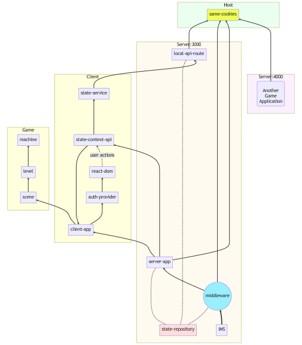

# Gamified Trading Application (GTA) | ByteCity
ByteCity is an intuitive platform that optimizes learning and simplifies investing through gamification and automated processes.


## Project Structure
- public/
    - icons/
    - images/
- script/
    - constant/
        - json/
    - state/
        - context/
        - repository/
        - service/
    - util/
        - helper/
        - hook/
        - playwright/
        - type/
- src/
    - 3d/
    - app/
        - api/
            - auth/
            - demo/
        - layout.tsx
        - page.tsx (landing page of the app)
    - dom/
        - atoms/
            - common/
            - holders/
            - inputs/
        - cell/
        - organ/
            - carousel/
            - form/
            - table/
    - module/
        - */
    - model/
        - */
    - middleware.ts
- style/
    - module/
    - *.css
- package.json


Diagram (https://mermaid.live/)
```lua    
graph BT; 
  subgraph Host
  same-cookies

  style Host fill:#eaFFf0
  end

  subgraph "Server4000"[Server:4000]
  a ---> same-cookies
   a("`Another
  Game
  Application`")
  style Server4000 fill:#faf0FF
  end


  subgraph "Server3000"[Server:3000]
  IMS ==> INIT
  state-repository -.- INIT
  INIT((middleware)) --> server-app
  server-app --> same-cookies
  INIT --> same-cookies
  state-repository -.- server-app

  local-api-route --> same-cookies

  style state-repository fill:#ffdddd
  style same-cookies fill:#EFFF55
  style INIT fill:#99EFFF

  style Server3000 fill:#FFfaf0
  end


  subgraph Client
  server-app --> client-app
  client-app --> auth-provider
  auth-provider --> react-dom

  state-context-api --> state-service
  state-service --> local-api-route
  state-repository -.- local-api-route

  server-app --> state-context-api
  state-context-api -->client-app
  react-dom -.->|user actions|state-context-api 
  end

  subgraph Game
  scene
  client-app --> scene
  scene --> level
  level --> machine
  end
```


